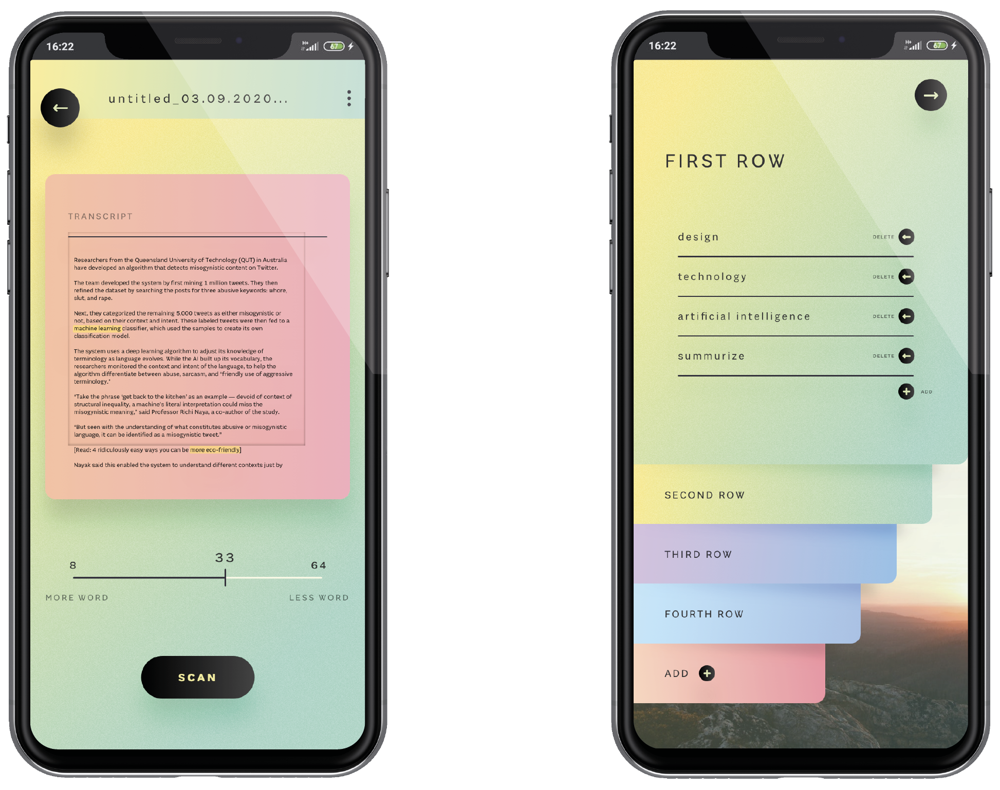

# Making invisible visible (2) #

```
Terminato in settembre 2020
```
<br>

## Abstract ##

T2M è un applicativo che, tramite modelli di intelligenza artificiale, sintetizza un testo in parole chiave. Al termine viene visualizzata una mappa di parole che, disposte in base all’importanza, restituiscono in sintesi il senso generale del discorso, dando infine la possibilità all’utente di affinare il risultato ottenuto con correzioni.

<br>

## Prototipi P5 ##


[Text2Map - P5.speech + Dandelion entity-detection](https://editor.p5js.org/Gregg-lash/sketches/T1b3uA2CG)

<br>

[Text2Map - Dandelion entity-detection + visual](https://editor.p5js.org/Gregg-lash/sketches/EU1G-me0T)

<br>

## Progetto ##



<br>


