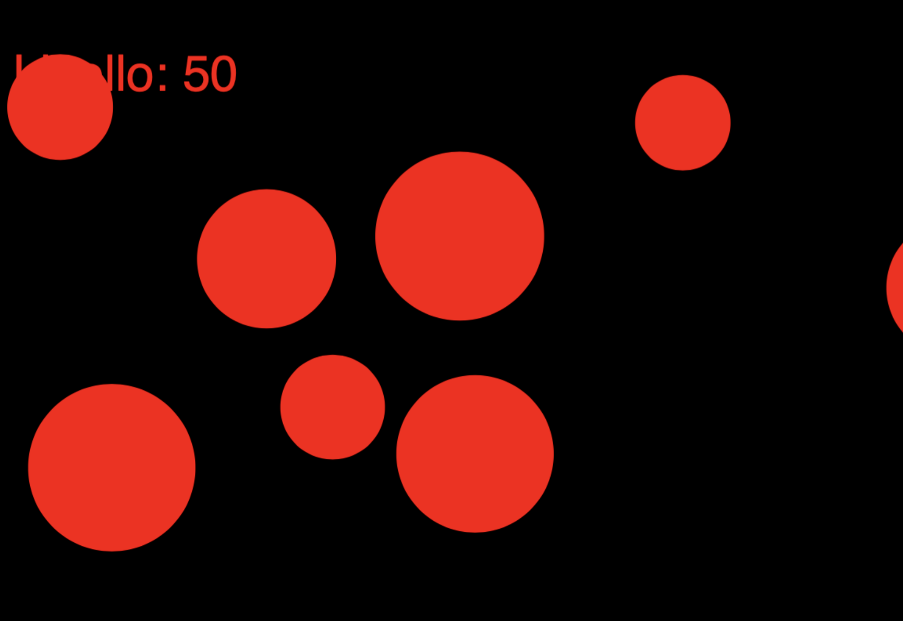
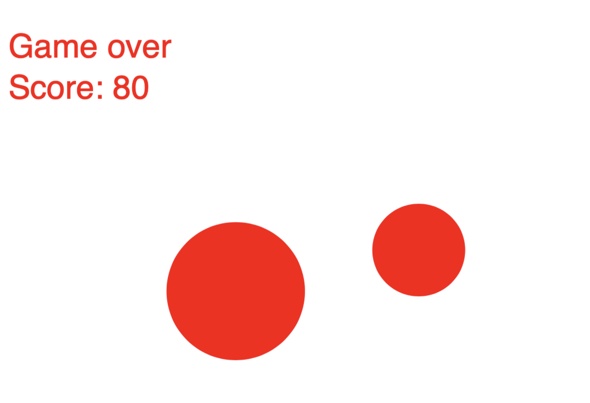

## Miss the balls - _game_

[Full screen](https://editor.p5js.org/Gregorio-V/full/8CdP1HCfl)

_Miss the balls_ è un gioco survival in cui bisogna schivare con il cursore le palline che si muovono nel canvas.

Ogni 5 secondi si guadagnano 10 punti e le palline accelerano di velocità e si ingrandiscono.
Si ha un numero limitato di vite, ad ogni contatto con un oggetto si perde vita, si ha un flash bianco e si accelera e ingrandisce la pallina toccata.

Il gioco finisce quando si sono consumate tutte le vite.

Uscire dal canvas con il mouse azzerà il punteggio.
