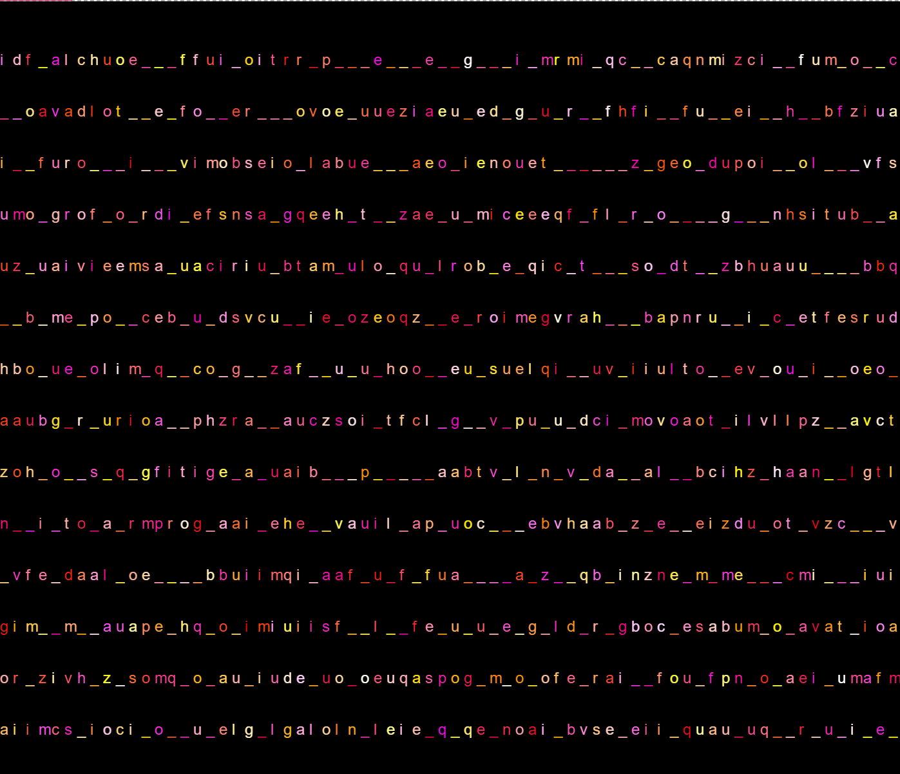

# ESERCIZIO 3

--------------------------------------------------------------------------------------------------------------------------------------------------------------------------------------------------------------------------------

### immagine in questo [Link](https://editor.p5js.org/mgabriella/full/OMJyGGIgl).

variazione con lettere e _ colorate

