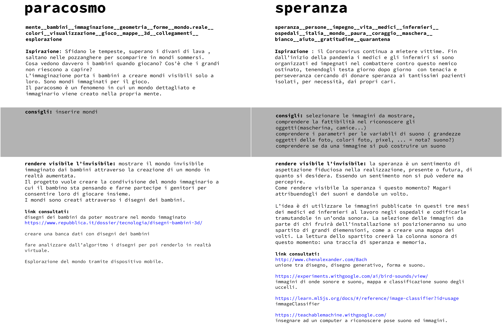

# MAKING VISIBLE.

### Scelta del tema

### Tema 1: Paracosmo

#### Parole chiave: mente__bambini__immaginazione__geometria__forme__mondo.reale__ colori__visualizzazione__gioco__mappe__3d__collegamenti__ esplorazione

**Ispirazione:** Sfidano le tempeste, superano i divani di lava , saltano nelle pozzanghere per scomparire in mondi sommersi. Cosa vedono davvero i bambini quando giocano? Cos'è che i grandi non riescono a capire? L’immaginazione porta i bambini a creare mondi visibili solo a loro. Sono mondi immaginati per il gioco. Il paracosmo è un fenomeno in cui un mondo dettagliato e immaginario viene creato nella propria mente.

**rendere visibile l’invisibile:** mostrare il mondo invisibile immaginato dai bambini attraverso la creazione di un mondo in realtà aumentata. Il progetto vuole creare la condivisione del mondo immaginario a cui il bambino sta pensando e farne partecipe i genitori per consentire loro di giocare insieme. I mondi sono creati attraverso i disegni dei bambini.

**link utili**  
[Articolo di Repubblica](https://www.repubblica.it/dossier/tecnologia/disegni-bambini-3d/)

--------------------------------------------------------------------------------------------------------------------------------------------------------------------------------

### Tema 2: Speranza

#### Parole chiave: speranza__persone__impegno__vita__medici__infermieri__ ospedali__italia__mondo__paura__coraggio__maschera__ bianco__aiuto__gratitudine__quarantena

**Ispirazione:** il Coronavirus continua a mietere vittime. Fin dall’inizio della pandemia i medici e gli infermiri si sono organizzati ed impegnati nel combattere contro questo nemico ostinato, tenendogli testa giorno dopo giorno con tenacia e perseveranza cercando di donare speranza ai tantissimi pazienti isolati, per necessità, dai propri cari.

**Consigli compagni di corso:** selezionare le immagini da mostrare, comprendere la fattibilità nel riconoscere gli oggetti(mascherina, camice...) comprendere i parametri per le variabili di suono ( grandezze oggetti delle foto, colori foto, pixel, ... = nota? suono?) comprendere se da una immagine si può costruire un suono

**rendere visibile l’invisibile:** la speranza è un sentimento di aspettazione fiduciosa nella realizzazione, presente o futura, di quanto si desidera. Essendo un sentimento non si può vedere ma percepire. Come rendere visibile la speranza i questo momento? Magari attribuendogli dei suoni e dandole un volto. L’idea è di utilizzare le immagini pubblicate in questi tre mesi dei medici ed infermieri al lavoro negli ospedali e codificarle tramutandole in un’onda sonora. La selezione delle immagini da parte di chi fruirà dell’installazione si posizioneranno su uno spartito di grandi diemensioni, come a creare una mappa dei volti. La lettura dello spartito creerà la colonna sonora di questo momento: una traccia di speranza e memoria.

**link utili**  
[unione tra disegno, disegno generativo, forma e suono.](http://www.chenalexander.com/Bach)  
[immagini di onde sonore e suono, mappa e classificazione suono animali.](https://experiments.withgoogle.com/ai/bird-sounds/view/)    
[immageClassifier](https://learn.ml5js.org/docs/#/reference/image-classifier?id=usage)  
[insegnare ad un computer a riconoscere pose suono ed immagini.](https://teachablemachine.withgoogle.com)
---------------------------------------------------------------------------------------------------------------------------------------

---------------------------------------------------------------------------------------------------------------------------------------
**Revisione 1**  
Creare una banca dati con disegni dei bambini.  
Fare analizzare dall’algoritmo i disegni per poi renderlo in realtà virtuale.  
Esplorazione del mondo da creare attraverso il cellulare.

