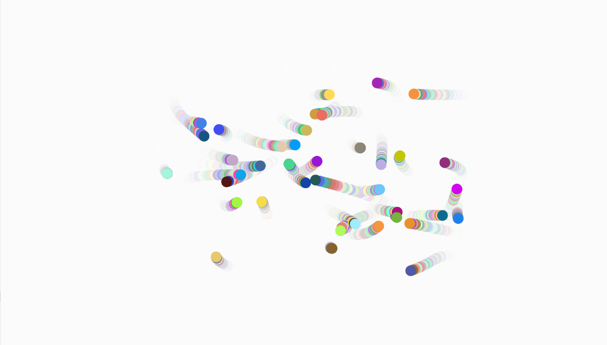

# Balls_scia2_white
 
--------------------------------------------------------------------------------------------------------------------------------------------------------------------------------------------------------------------------------
 
### immagine in questo [Link](https://editor.p5js.org/mgabriella/full/Z9loF3z-n).
 

L'esercizio presenta camminatori che cambiano colore in modo randomico. Al loro passaggio si vede la SCIA delle loro posizioni 
precedenti, grazie all'inserimento di un rettangolo bianco con le dimensioni dello sfondo che si rigenera ogni volta dietro al draw() delle palline.
